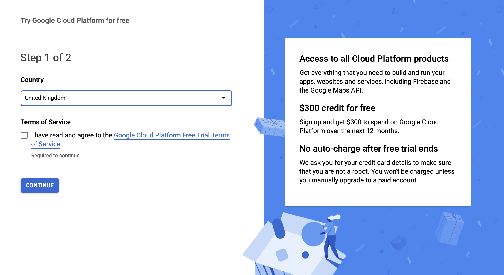
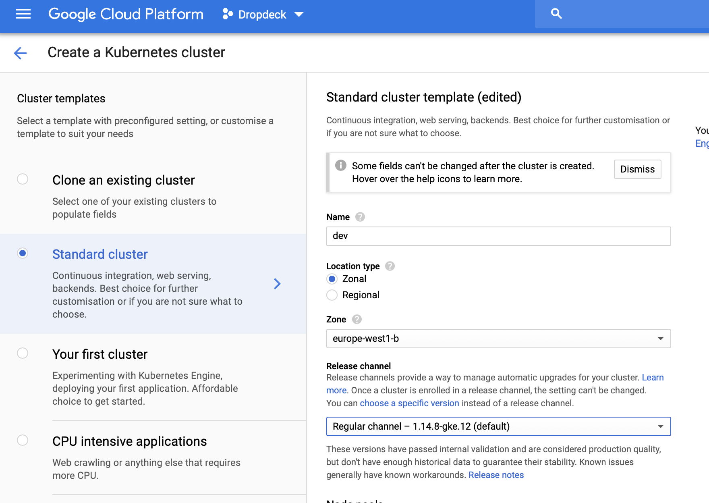

# Dropdeck Kubernetes configuration
This guide outlines the steps to install Dropdeck on a Kubernetes (`k8s`) cluster, using the Helm template management tool. These steps are focused on the GCP (Google Cloud Platform) Kubernetes provider but the same overall process should work on any other Kubernetes provider. 


## Prerequisites

### Google Cloud setup
[Google Cloud Platform](https://console.cloud.google.com/freetrial/signup)




Once set up, I created a new `Dropdeck` GCP project - ID `dropdeck`. This will be used henceforth in this manual.

### Create a GCP cluster
Next we create a cluster named `dev` in `europe-west1-b` via the Google Cloud console:



Note: You need to create a **private** cluster (under Networking), so we can control external IP access.

### Login via the `gcloud` CLI
In your terminal, log in to the GCloud account that owns the new cluster:

```
gcloud auth login
```

*Note*: This assumes you have the `gcloud` CLI installed.

This will open up a browser window and trigger OAuth authentication against Google. Make sure to log into the same Google account as you used to set up the new GCP project, above.

```
You are now logged in as [name@dropdeck.com].
Your current project is [some-project].  You can change this setting by running:
```

Let’s change the project:

```
gcloud config set project dropdeck
```

Verify that you are logged in against the correct project:

```
gcloud projects list

PROJECT_ID  NAME      PROJECT_NUMBER
dropdeck    Dropdeck  475661889060
```

### Install Helm
Helm is a package manager for Kubernetes that helps you install and manage applications on your Kubernetes cluster. Regardless of which Kubernetes platform you're using (e.g. GKE, EKS, or OpenShift), you need to install `helm` on your workstation, as it is required to install Dropdeck for any Kubernetes platform.

On OSX, you can install `helm` using Homebrew:

```
brew install kubernetes-helm
```

If you already have `helm` installed, make sure you're using the latest version:

```
brew upgrade kubernetes-helm
```

*Note*: The Dropdeck Helm chart requires Helm v3. Please ensure that your version is greater than this, you can check by running `helm version`.

## Connect via `kubectl`
Note: This assumes you have the `kubectl` CLI installed on your workstation.

Run the following command to get the context for your new `dev` cluster (created above):

```
gcloud container clusters get-credentials preview --zone europe-west1-c --project dropdeck
```

You can verify that the cluster details have been added by running

```
kubectl config get-contexts
```

This should produce an output similar to the following

```
CURRENT   NAME                                  CLUSTER                               AUTHINFO                             NAMESPACE
*         gke_dropdeck_europe-west1-b_dev       gke_dropdeck_europe-west1-b_dev       gke_dropdeck_europe-west1-b_dev
```

## Setting up a Kubernetes cluster

### Create a TLS secret for Ingress deployments
Most browsers will complain about the default SSL self-signed certificate we get with Kubernetes, so it is a good idea to set up a proper SSL certificate. Assuming you have a certificate at hand, download its private key and certificate files and store as `dropdeck_com.key` and `dropdeck_com.crt`, respectively. 

Some certificate providers, such as GoDaddy, will also provide you with a bundle of intermediate certificates; these have to be installed also in your TLS secret, so that the client can verify the certificate chain. For example, the GoDaddy SSL certificate package you will download should include a file called `gd_bundle-g2-g1.crt` containing the intermediate certificates. Assuming you have stored your intermediate certificate bundle in a file called `dropdeck_com-ca_bundle.crt`, create a new combined certificate (your server certificate along with the intermediate issuer certificates) as follows:

```
cat dropdeck_com.crt dropdeck_com-ca_bundle.crt > full_dropdeck_com.crt
```

Hereafter we assume you have a combined certificate stored in `full_dropdeck_com.crt`. If you don't require any intermediate certificates, simply rename your `dropdeck_com.crt` to `full_dropdeck_com.crt` without any changes.

Now you should create a new secret called `dropdeck-cert` as follows:

```
kubectl create secret tls dropdeck-cert --key dropdeck_com.key --cert full_dropdeck_com.crt 
```

If you skip this step, you will need to use a different deployment for the Nginx Ingress controller in the next step.

### Nginx Ingress controller 
*Reference*: [Installation Guide - NGINX Ingress Controller](https://kubernetes.github.io/ingress-nginx/deploy/#gce-gke)

Via `kubectl`

```
kubectl create clusterrolebinding cluster-admin-binding \
  --clusterrole cluster-admin \
  --user $(gcloud config get-value account)
```

Create the `ingress-nginx` namespace and initial deployment.


```
kubectl apply -f deployment/ingress-nginx/controller-v0.32.0/deploy.yaml
```

**Note**: This assumes you have a TLS certificate called `dropdeck-cert` already created. To check that this exists, run:

```
kubectl get secrets
```

This should list a `dropdeck-cert` of type `kubernetes.io/tls`:

```
NAME                                                         TYPE                                  DATA   AGE
dropdeck-cert                                             kubernetes.io/tls                     2      <n> m
...
```

To change the name of the certificate, change the 

```
args:
    ...
    - --default-ssl-certificate=default/dropdeck-gd-cert # The TLS secret defined from a GoDaddy certificate.
```

If you don't have a TLS secret in place, you can still create the Ingress controller using the default configuration:

```
kubectl apply -f https://raw.githubusercontent.com/kubernetes/ingress-nginx/controller-0.32.0/deploy/static/provider/cloud/deploy.yaml
```


This outputs

```
namespace/ingress-nginx created
serviceaccount/ingress-nginx created
configmap/ingress-nginx-controller created
clusterrole.rbac.authorization.k8s.io/ingress-nginx created
clusterrolebinding.rbac.authorization.k8s.io/ingress-nginx created
role.rbac.authorization.k8s.io/ingress-nginx created
rolebinding.rbac.authorization.k8s.io/ingress-nginx created
service/ingress-nginx-controller-admission created
service/ingress-nginx-controller created
deployment.apps/ingress-nginx-controller created
validatingwebhookconfiguration.admissionregistration.k8s.io/ingress-nginx-admission created
clusterrole.rbac.authorization.k8s.io/ingress-nginx-admission created
clusterrolebinding.rbac.authorization.k8s.io/ingress-nginx-admission created
job.batch/ingress-nginx-admission-create created
job.batch/ingress-nginx-admission-patch created
role.rbac.authorization.k8s.io/ingress-nginx-admission created
rolebinding.rbac.authorization.k8s.io/ingress-nginx-admission created
serviceaccount/ingress-nginx-admission created
```

To check if the ingress controller pods have started, run the following command:

```
kubectl get pods --all-namespaces -l app.kubernetes.io/name=ingress-nginx --watch
```

Once the operator pods are running, you can cancel the above command by typing Ctrl+C. Now, you are ready to create your first ingress.

To detect which version of the ingress controller is running, exec into the pod and run

```
POD_NAMESPACE=ingress-nginx
POD_NAME=$(kubectl get pods -n $POD_NAMESPACE -l app.kubernetes.io/name=ingress-nginx -o jsonpath='{.items[0].metadata.name}')

kubectl exec -it $POD_NAME -n $POD_NAMESPACE -- /nginx-ingress-controller --version
```

### Install the Helm builder
Follow the instructions [here](https://github.com/GoogleCloudPlatform/cloud-builders-community/tree/master/helm) to install the Helm Google Cloud Builder in your project.

*Note*: Make sure to grant the Cloud Build Service Account the `cluster-admin` role as described in those instructions.

## Deployment


### Deployment script
The project comes with a handy shell script for deployments. This assumes you have all of the CLI tools referenced above installed (`gcloud`, `kubectl`, `helm`) and have pulled down the credentials of the Kubernetes cluster you're targeting.

In the root of the project, run

```
./deploy-k8s.sh <cluster-name> [<image-tag>]
```

where `<cluster-name>` is the name of the Kubernetes cluster we're deploying to, and the optional `<image-tag>` is tag for the `api` and `app` Docker images we will deploy. When not specified, the deployment targets Docker images with the tag that matches the `<cluster-name>`.

*Example:*

```
./deploy-k8s.sh qa-cluster beta-release
``` 

### Helm commands

In the root of the project, run

```
helm dep up deployment/helm/dropdeck -f deployment/helm/dropdeck/values.preview.yaml
```

This should produce output similar to the following:

```
Hang tight while we grab the latest from your chart repositories...
...Successfully got an update from the "stable" chart repository
Update Complete. ⎈Happy Helming!⎈
Saving 2 charts
Deleting outdated charts
```

We can then install the combined Helm chart like so:

```
helm upgrade --install --namespace default default deployment/helm/dropdeck -f deployment/helm/dropdeck/values.preview.yaml
```

If you want to test the combined chart before you install it, run the above with a `--dry-run` flag:

```
helm upgrade --install --namespace default default deployment/helm/dropdeck -f deployment/helm/dropdeck/values.preview.yaml --dry-run
```

### Deploying deck.show Ingress routes
Firstly, make sure you are using the `preview` cluster context:

```
kubectl config use-context gke_dropdeck_europe-west1-c_preview
```

Then, update the `deck.show` Ingress configuration like so:

```
kubectl apply -f deployment/clusters/preview/deck-show-ingress.yaml
```


## Monitoring

We use Promotheus and Grafana for monitoring and reporting.

https://console.cloud.google.com/kubernetes/application/europe-west1-c/preview/default/prometheus/details?project=dropdeck

To forward to a local port:

```
kubectl port-forward --namespace default prometheus-grafana-0 3000
```

Open http://localhost:3000 and log in using `admin/FK1FzvVnuPCJ`.
